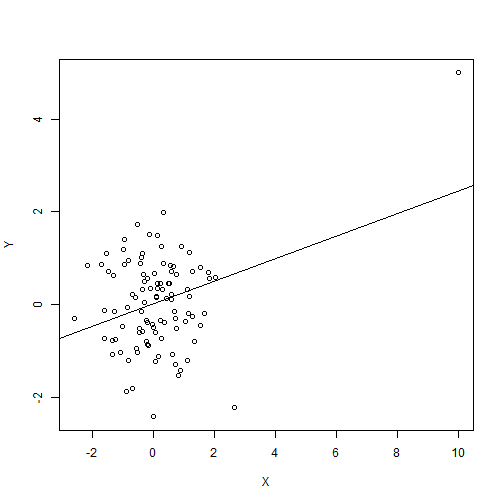

## Background

### - Influence Analysis is performed to evaluate influential observations in regression models.

### - A simple interactive Shiny App is presented here to clarify the intuition behind leverage and influence.


---  .class #id

## Application Overview

- The app demonstrates the leverage and influence of an adjustable point that is part of a dataset with 101 points; 100 of which are normally distributed. You can select the X-Y coordinates of the adjustable point using the following sliders with ranges from [-10,10] for both X and Y. The adjustable point appears in red on the graph.

- For every point you choose, The Linear regression model coefficients are updated and also some of the influence measures such as *hatvalue*, *residual* and *dfbeta* are shown.

---  .class #id

## Application Implementation

- We start by generating 100 normally distributed data points


- the point 101 is added according to the user's choice by using the sliders. For example if the user chooses [10,5] it will be prepended to the previously generated points as follows:


```r
head(newDF)
```

```
##            X          Y
## 1 10.0000000  5.0000000
## 2  0.2115549 -0.3396219
## 3 -0.7103840  0.2055222
## 4 -0.2457418 -0.3441439
## 5 -0.3707048  1.0913543
## 6  1.1138776  0.3280097
```

---  .class #id

## Influence Analysis Measures

- The app gives the user the chance to play with different points to understand the concepts of leverage and influence. A plot is also shown to see the location of the point and how the regression line moves as a lever according to the chosen point coordinates. 




---  .class #id
## App Link and Further Explanation

[Shiny App](https://omaymas.shinyapps.io/Influence_Analysis/)

[Blog Post : Leverage and Influence in a Nutshell](http://omaymas.github.io/InfluenceAnalysis/)

